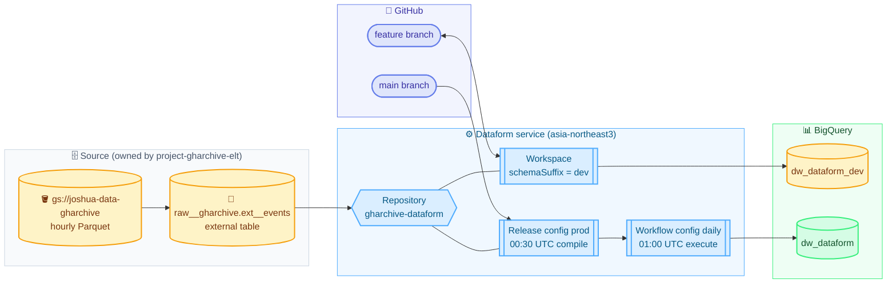
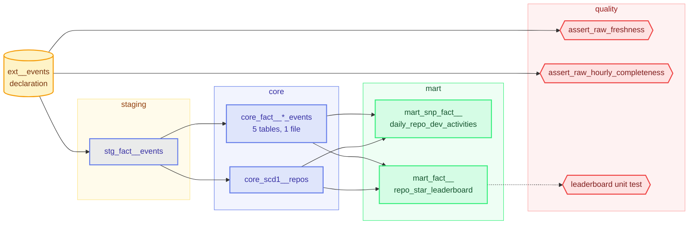

# project-dataform-with-gharchive-elt

**What this is.** The same stg → core → mart warehouse that
[`project-gharchive-elt`](https://github.com/joshua-data/project-gharchive-elt) builds with dbt, rebuilt
in **Dataform** on the same source table — so the two can be run side by side and compared row for row.
It is a learning project with a second job: it is the reference for how Dataform, BigQuery datasets and
IAM should be wired up as code in `joshua-data`.

**How it runs.** A Dataform core 3.x project at the repository root, compiled and executed by the managed
Dataform service in `asia-northeast3`. Every GCP resource — datasets, service accounts, IAM, the Dataform
repository, its release config and its workflow config — is declared in `terraform/` and applied by
GitHub Actions over Workload Identity Federation.

**Where to start reading.** `workflow_settings.yaml` for the project-wide settings,
`includes/gharchive.js` for the shared helpers, then `definitions/staging/stg_fact__events.sqlx`.
For the infrastructure, [`terraform/README.md`](terraform/README.md).

---

## Architecture



Compilation and execution are **separate** in Dataform. The workflow config executes whatever the release
config compiled most recently, which is why 00:30 has to come before 01:00 — otherwise each day's run
executes the previous day's code.

---

## The pipeline



`dataform compile` produces **28 actions**: 9 datasets and 19 assertions, plus the source declaration.
One unit test runs separately under `dataform test`. (Verified 2026-09-30 — every one of the 28 also
passes a BigQuery `--dry_run`.)

| File | Builds | Notes |
|---|---|---|
| `definitions/sources/ext__events.sqlx` | — | Source declaration. Dataset suffixes never apply to declarations, so a dev run still reads production raw data. |
| `definitions/staging/stg_fact__events.sqlx` | `stg_fact__events` | Incremental MERGE on `event_id`. `QUALIFY` collapses duplicate source rows. Column-for-column identical to the dbt model of the same name. |
| `definitions/core/core_fact_events.js` | 5 × `core_fact__*_events` | One file, five tables. Add an entry to `EVENT_FACTS` and a table appears. |
| `definitions/core/core_scd1__repos.sqlx` | `core_scd1__repos` | SCD1 with a hand-written guard that stops MERGE from clobbering `created_at` / `updated_at`. |
| `definitions/mart/mart_snp_fact__daily_repo_dev_activities.sqlx` | daily repo activity | `dependOnDependencyAssertions: true` — will not build if an upstream assertion failed. |
| `definitions/mart/mart_fact__repo_star_leaderboard.sqlx` | 7-day star leaderboard | Plain `table`, deliberately free of `pre_operations` so it is unit-testable. |
| `definitions/assertions/*.sqlx` | 2 source assertions | Freshness and hourly completeness of the raw feed. |
| `definitions/tests/*.sqlx` | 1 unit test | CLI only; workflow invocations never run unit tests. |

**Only the five event types the marts actually consume are built.** `ReleaseEvent` and `CreateEvent`
used to be generated and then referenced by nothing — they were removed. The dbt project builds 16 event
fact tables; covering 5 here is a deliberate scope decision, and the column named `counted_events_count`
in the mart exists to make that scope impossible to forget (see *Comparing against the dbt build*).

---

## Datasets

Everything Dataform builds — tables **and** assertion result views — lands in one dataset pair, with the
layer encoded in the object name. That mirrors how the dbt project uses `dw` / `dw_dev`, and keeps the
two toolchains cleanly separated:

| Dataset | Built by | Written when |
|---|---|---|
| `dw` / `dw_dev` | dbt (`project-gharchive-elt`) | untouched by this repo |
| `dw_dataform` | Dataform | the `daily` workflow config, 01:00 UTC |
| `dw_dataform_dev` | Dataform | console workspace runs and local `dataform run --schema-suffix=dev` |

The `_dev` suffix is written down exactly once, as `schema_suffix = "dev"` in `terraform/dataform.tf`.
Dataform core supplies the underscore itself, so `dw_dataform` becomes `dw_dataform_dev`. Writing
`"_dev"` there would produce `dw_dataform__dev`.

`dw_dataform_dev` carries a 14-day default table expiration, because development tables are rebuilt
constantly and nobody prunes them by hand.

> **Neither dataset exists yet (checked 2026-09-30).** `joshua-data` currently holds only
> `raw__gharchive`, `dw` and `dw_dev`. Nothing in this repository has been deployed: there is no Dataform
> repository in `asia-northeast3`, and the `gharchive-dataform-*` service accounts have not been created,
> because `terraform/` has never been applied. The code compiles and dry-runs clean — it has simply not
> been run yet. See *Getting started* below.

---

## Source data

`joshua-data.raw__gharchive.ext__events` — an external table over hive-partitioned Parquet
(`dt` DATE, `hr` INT64) in `gs://joshua-data-gharchive/events/`, written hourly by the Cloud Run job in
`project-gharchive-elt`.

The schema is **completely flat — 11 columns, no STRUCT, no BigQuery `JSON` type**:

| Column | Type | Note |
|---|---|---|
| `id` | INTEGER | event id |
| `type` | STRING | `PushEvent`, `WatchEvent`, … |
| `actor`, `repo`, `org`, `payload` | **STRING** | JSON *text*, not a JSON column. Every field access goes through `JSON_VALUE(col, '$.path')`. |
| `public` | BOOLEAN | |
| `created_at`, `ingested_at` | **STRING** | ISO 8601 text, not TIMESTAMP |
| `hour` | STRING | e.g. `2026-09-24-0`. Unused. |
| `dt`, `hr` | DATE, INTEGER | hive partition keys |

No BigQuery-native partitioning or clustering, and metadata caching is off — pruning comes only from
`dt` / `hr`. That is why `stg_fact__events` filters on `dt` and takes `created_date` straight from it
rather than recomputing it from `created_at`.

Verified against the live table on **2026-09-30**:

| Fact | Value | Where it shows up |
|---|---|---|
| Range | 2026-06-01 .. 2026-09-24, 116 days, **359,058,631 rows**, 90.4 GB in GCS | cost planning, `prod_stg_start_date` |
| Distinct event types | 16 | the 5 built here are a deliberate subset |
| ForkEvent rows with a NULL `repo_id` (2026-09-08..11) | **124 of 34,265** (0.36%) | `repoIdCanBeNull`, the `nonNull` assertion |
| Incomplete days | 2026-06-01 (1h), 2026-06-02 (21h), 2026-08-07 (21h), 2026-09-24 (7h) | `assert_raw_hourly_completeness` |
| Last `ingested_at` | **2026-09-24T07:30:14Z** — about 144 hours stale | `assert_raw_freshness` |

> **Both source assertions fail today, and that is correct.** The `gharchive` Cloud Scheduler job in
> `project-gharchive-elt` is `PAUSED`, so the feed stopped on 2026-09-24. Un-pause that scheduler, or
> treat the failures as the intended demonstration of what an assertion is for.

### What the dbt warehouse holds, for comparison

`joshua-data.dw` is fully materialised (41 tables) but **only up to `created_date` 2026-09-11** — it was
last built on 2026-09-12 and is 13 days behind the raw feed. Any comparison between the two warehouses
must therefore stay inside **2026-09-01 .. 2026-09-11**.

---

## Getting started

### 1. Prerequisites you create by hand

```bash
# private GitHub repository
gh repo create joshua-data/project-dataform-with-gharchive-elt --private

# fine-grained PAT scoped to that one repository, Contents: Read and write.
# Put it in Secret Manager yourself — a secret authored by Terraform is stored in the
# state file in plaintext, and this project keeps the token out of state entirely.
printf '%s' "YOUR_GITHUB_TOKEN" | gcloud secrets create dataform-github-token \
  --project=joshua-data \
  --replication-policy=automatic \
  --data-file=-

# push, so main exists and Dataform has something to compile
git init && git add -A && git commit -m "feat: dataform project and terraform" \
  && git branch -M main \
  && git remote add origin https://github.com/joshua-data/project-dataform-with-gharchive-elt.git \
  && git push -u origin main
```

### 2. First apply, locally

The CI service account and its WIF provider are created *by* this Terraform, so the first apply cannot
run in CI. See [`terraform/README.md`](terraform/README.md) for the full runbook.

```bash
cd terraform
cp terraform.tfvars.example terraform.tfvars
terraform init \
  -backend-config="bucket=joshua-data-gharchive-tfstate" \
  -backend-config="prefix=dataform/state"
terraform plan    # 36 to add
terraform apply
```

### 3. Local Dataform CLI — the fastest path, no Terraform needed

You do **not** need the Dataform service, a GitHub repository, or Terraform to run this pipeline. The
CLI plus one BigQuery dataset is enough, and that is the recommended way to work through it the first time.

```bash
npm i -g @dataform/cli@3.0.71      # or prefix every command with `npx -y @dataform/cli@3.0.71`
gcloud auth application-default login
dataform init-creds          # choose ADC and asia-northeast3; writes .df-credentials.json (gitignored)
```

There is **no `dataform install` step** and no `package.json` in this repository. Since Dataform core 3.x,
`workflow_settings.yaml` declares `dataformCoreVersion` and the CLI fetches it at runtime. Running
`dataform install` here errors out on purpose: *"No installation is needed when using
workflow_settings.yaml"*.

```bash
dataform compile                    # 28 actions — touches BigQuery not at all
dataform compile --json > /tmp/compiled.json
dataform test                       # the leaderboard unit test; literal rows only, no cost
```

Then create the dev dataset once and build:

```bash
# one-time: the dev dataset, with a 14-day table expiration
bq --location=asia-northeast3 mk --dataset \
   --default_table_expiration=1209600 \
   --description="Dataform-built warehouse (dev)" \
   joshua-data:dw_dataform_dev

# ALWAYS pass the suffix for local runs, or you write straight to production.
dataform run --schema-suffix=dev --dry-run          # prints the SQL, executes nothing
dataform run --schema-suffix=dev --tags=stg
dataform run --schema-suffix=dev --tags=core
dataform run --schema-suffix=dev --tags=mart
```

Cost for the default window (`stgStartDate = 2026-09-01`, i.e. 2026-09-01 .. 09-24): roughly **35 GB**
of external Parquet scanned, about **$0.22** on-demand. Narrow it with
`--vars=stgStartDate=2026-09-09` if you only want a smoke test.

---

## Day-to-day

| Task | Command |
|---|---|
| See the graph without touching BigQuery | `dataform compile` |
| Inspect both compiled variants of an incremental model | `dataform compile --json` |
| Run unit tests | `dataform test` |
| Run one layer into dev | `dataform run --schema-suffix=dev --tags=stg` (then `core`, `mart`) |
| Rebuild from scratch | `dataform run --schema-suffix=dev --full-refresh` |
| Try a different var | `dataform run --schema-suffix=dev --vars=lookbackDays=7` |
| Check what actually went to BigQuery | query `region-asia-northeast3.INFORMATION_SCHEMA.JOBS_BY_USER` |

The console workspace is the other development surface: it picks up the repository's workspace
compilation overrides automatically, so it writes to `dw_dataform_dev` with no flags to remember.

---

## Things worth knowing before you change something

**A failing assertion does not stop downstream tables.** Dataform treats only table *creation* as a
dependency. `mart_snp_fact__daily_repo_dev_activities` sets `dependOnDependencyAssertions: true` to get
the behaviour `dbt build` has by default. Remove it and the mart happily builds on data its own upstream
assertion just rejected.

**MERGE overwrites every column.** There is no equivalent of dbt's `merge_update_columns` or
`merge_exclude_columns`. A column that must keep its original value has to defend itself in SQL — see the
`when(incremental(), ...)` branch in `core_scd1__repos`, where `created_at` falls back to
`coalesce(existing.created_at, latest.created_at)` and `updated_at` only advances when `repo_name` or
`repo_object_url` actually changed. Delete that branch and every incremental run silently resets
`created_at` to the current batch, with no error and no failing assertion. That is exercise Lv6.

**`updatePartitionFilter` must cover everything arriving in the run.** MERGE only compares against target
rows inside the filter; a matching key outside it is missed and re-inserted as a duplicate. That is why
the source filter and the MERGE filter are driven by the same `checkpoint_date` variable.

**Every release-config var key is mandatory.** `code_compilation_config.vars` replaces the committed
`vars` block wholesale rather than merging into it. Drop a key there and it compiles to `undefined`.

**`$${workspaceName}` needs the doubled dollar sign** if you ever switch to per-developer dataset
suffixes in `terraform/dataform.tf`, or Terraform tries to interpolate it and fails at plan time.

**`require_partition_filter` is deliberately OFF here, and dbt has it ON.** This is the sharpest
difference between the two projects, and it is not an oversight.

In dbt every partitioned model sets `require_partition_filter: true`, and every test carries a
`config.where` so it still passes:

```yaml
- not_null:
    config:
      where: "created_date between __batch_start_date__ and __batch_end_date__"
```

Dataform's built-in `assertions:` block has **no `where` option**. Turn `requirePartitionFilter` on and
every generated assertion starts failing with *"Cannot query over table … without a filter over
column(s) 'created_date'"*, because each one is a bare `SELECT … FROM <target>`.

It breaks a second thing too. `checkpointDeclare()` emits
`SELECT MAX(created_date) FROM <self>` with no filter — so **every incremental run** would fail at the
`DECLARE`, before the main query even starts.

Both failure modes are reproducible: point the compiled SQL at the dbt `dw` dataset (which *does* have
the flag on) and `bq query --dry_run` rejects 21 of the 28 statements for exactly these two reasons.

The escape hatch, if you ever need the flag, is to drop the `assertions:` blocks and hand-write each
check as its own `type: "assertion"` file with the partition filter inlined — which is precisely what
dbt's `config.where` is doing under the hood.

---

## Reading the JavaScript

There are exactly **two** JavaScript files, and between them about 40 lines of real logic. Everything
else is a data table or a comment. If you are not a JS person, read them in this order.

### `includes/gharchive.js` — the shared helpers (dbt's `macros/`)

The file name becomes the global object. Because this file is `gharchive.js`, every `.sqlx` and `.js`
under `definitions/` can write `gharchive.jsonInt(...)` with no import statement.

It exports three kinds of thing, and **all of them only build strings**. Nothing in this file talks to
BigQuery.

**1. Four tiny functions that produce one SQL expression each.**

```js
function jsonRaw(column, path) {
  return `nullif(trim(json_value(${column}, '$.${path}')), '')`;
}
```

The backtick string is a *template literal* — the JS equivalent of an f-string. `${column}` is spliced
in. So `jsonRaw("actor", "id")` returns the text
`nullif(trim(json_value(actor, '$.id')), '')`.

`jsonString` / `jsonLower` / `jsonInt` each wrap that differently:

| call | produces |
|---|---|
| `jsonString("actor", "url")` | `nullif(trim(json_value(actor, '$.url')), '')` |
| `jsonLower("repo", "name")` | `lower(nullif(trim(json_value(repo, '$.name')), ''))` |
| `jsonInt("actor", "id")` | `safe_cast(nullif(trim(json_value(actor, '$.id')), '') as int64)` |

Three names instead of one `jsonCol(col, path, type)` with a mode flag, so the call site tells you what
SQL comes out. `jsonByType` is just an `if` chain that picks one of the three from a `"string"` /
`"lower"` / `"int64"` label — only the generator uses it.

Those exact expressions are copied from the dbt staging model. That is not stylistic: it is what makes
the two warehouses comparable.

**2. `checkpointDeclare(isIncremental, selfTable, dateColumn)`.**

Three positional arguments, and it returns one line of SQL:

```sql
-- first build / --full-refresh
DECLARE checkpoint_date DATE DEFAULT (SELECT DATE('2026-09-01'));

-- incremental build
DECLARE checkpoint_date DATE DEFAULT (
  SELECT COALESCE(DATE_SUB(MAX(created_date), INTERVAL 2 DAY), DATE('2026-09-01'))
  FROM `joshua-data.dw_dataform.stg_fact__events`);
```

Drop it in `pre_operations` and the body can then say `where created_date >= checkpoint_date`. This is
the Dataform counterpart to dbt's `is_incremental()` + `batch_filter`.

Why a variable rather than `where created_date >= (select max(...) from ...)`? BigQuery cannot prune
partitions against a subquery. It prunes reliably against a scalar.

Why are `isIncremental` and `selfTable` passed *in* instead of called inside? In a `.sqlx` file
`self()` and `incremental()` are globals; in a `.js` file they only exist as `ctx.self()` /
`ctx.incremental()`. Passing the values lets both call styles share one function.

**3. `EVENT_FACTS` — an array, not code.**

One entry per table. It used to be an object keyed by event name, which is the only reason the generator
needed `Object.entries(...)` and array destructuring. As an array, a plain `for … of` is enough.

### `definitions/core/core_fact_events.js` — the generator

This is the one place Dataform does something dbt structurally cannot: **one file produces five tables.**
(In dbt, one model is one file — that is why `project-gharchive-elt` has 16 nearly identical
`core_fact__*.sql` files plus 16 `.yml` sidecars.)

The whole file is one loop with three steps:

```js
for (const fact of gharchive.EVENT_FACTS) {

  // 1. build the payload SELECT lines, one string per column
  const payloadLines = [];
  for (const col of fact.payloadColumns) {
    payloadLines.push(`    ${gharchive.jsonByType("payload", col.path, col.type)} as ${col.name},`);
  }
  const payloadSelect = payloadLines.join("\n");

  // 2. decide which columns get a nonNull assertion
  const nonNullColumns = ["event_id", "event_name", "created_date"];
  if (!fact.repoIdCanBeNull) nonNullColumns.push("repo_id");

  // 3. define the table
  const table = publish(`core_fact__${fact.tableSuffix}_events`, { /* config */ });
  table.preOps((ctx) => gharchive.checkpointDeclare(ctx.incremental(), ctx.self(), "created_date"));
  table.query((ctx) => `select * except (payload), ...`);
}
```

Three things worth naming:

- **`publish()` returns an object**, and `.preOps()` / `.query()` are set on it. You will see this
  written as one chain, `publish(...).preOps(...).query(...)`. Storing it in `table` first is the same
  thing, one step at a time.
- **`(ctx) => ...` is just a function** that takes `ctx` and returns a string. Dataform calls it during
  compilation, handing in a context object that knows the table's own name and whether this run is
  incremental. It is not special syntax — `function (ctx) { return ...; }` would work identically.
- **`select * except (payload)`** carries every staging column through automatically. Listing them by
  hand (which this file used to do) means core silently falls behind when staging gains a column.

To add a sixth event table, do **not** edit this file. Add an entry to `EVENT_FACTS`.

### Seeing what it produced

```bash
dataform compile --json > /tmp/compiled.json
python3 -c "
import json
d = json.load(open('/tmp/compiled.json'))
t = {x['target']['name']: x for x in d['tables']}['core_fact__push_events']
print(chr(10).join(t['incrementalPreOps']))
print(t['incrementalQuery'])
"
```

That prints the finished SQL for one generated table — the JavaScript's entire output, with nothing
left to imagine.

---

## Exercises

Three faults are built in on purpose. All three were re-verified on 2026-09-30.

| # | Change | Expected result |
|---|---|---|
| Lv4 | `includes/gharchive.js`: `fork_event`'s `repoIdCanBeNull` → `false` | `core_fact__fork_events` gains a `repo_id IS NOT NULL` row condition and fails on the empty-repo rows (0.36% of forks), and the mart is **skipped** rather than built. Remove `dependOnDependencyAssertions` from the mart and it builds anyway — that is Dataform's default. *Verified: flipping the flag does add the check to the compiled assertion.* |
| Lv5 | `mart_fact__repo_star_leaderboard.sqlx`: `>` → `>=` | `dataform test` fails with *Expected 2 rows, but saw 3 rows* — repo 3, sitting exactly on the boundary, enters the ranking. *Verified: the test passes before the change and fails after it.* |
| Lv6 | `core_scd1__repos.sqlx`: delete the `when(incremental(), ...)` branch so both paths use `latest.created_at` | Every assertion still passes and the data is wrong: `created_at` silently resets to the current batch's value on every run, and `updated_at` advances even when nothing changed. Only the verification query below catches it. |

```sql
-- Lv6: repos whose created_at is later than their true first appearance. Must be 0.
select count(*) as broken_repos
from `joshua-data.dw_dataform_dev.core_scd1__repos` as r
join (
  select repo_id, min(created_at) as true_created_at
  from `joshua-data.dw_dataform_dev.stg_fact__events`
  where created_date >= '2026-09-01'
  group by repo_id
) as s using (repo_id)
where r.created_at > s.true_created_at
```

Lv6 is the important one. Lv4 and Lv5 are caught by the tooling; Lv6 is the failure mode that ships.

---

## Comparing against the dbt build

This is the step that separates "code that looks right" from "code that is right". The staging layer
here is column-for-column identical to dbt's — same `nullif(trim(...))`, same `lower()` on join keys,
same `dt as created_date`, same `event_name` snake-casing — so the shared metrics must match exactly.

**The window has to be 2026-09-01 .. 2026-09-11.** `joshua-data.dw` was last built on 2026-09-12 and
holds nothing after 09-11; the raw feed runs to 09-24. Comparing outside that window compares against
missing data.

```sql
with
dbt as (
  select created_date, repo_id,
         pushes_count, prs_opened_count, prs_merged_closed_count,
         prs_unmerged_closed_count, prs_total_closed_count,
         issues_opened_count, issues_closed_count, watches_count, forks_count
  from `joshua-data.dw.mart_snp_fact__daily_repo_dev_activities`
  where created_date between '2026-09-01' and '2026-09-11'   -- require_partition_filter is ON here
),
df as (
  select created_date, repo_id,
         pushes_count, prs_opened_count, prs_merged_closed_count,
         prs_unmerged_closed_count, prs_total_closed_count,
         issues_opened_count, issues_closed_count, watches_count, forks_count
  from `joshua-data.dw_dataform_dev.mart_snp_fact__daily_repo_dev_activities`
  where created_date between '2026-09-01' and '2026-09-11'
)
select
  countif(dbt.repo_id is null) as only_in_dataform,
  countif(df.repo_id  is null) as only_in_dbt,
  sum(abs(dbt.pushes_count              - df.pushes_count))              as d_pushes,
  sum(abs(dbt.prs_opened_count          - df.prs_opened_count))          as d_prs_opened,
  sum(abs(dbt.prs_merged_closed_count   - df.prs_merged_closed_count))   as d_prs_merged,
  sum(abs(dbt.prs_unmerged_closed_count - df.prs_unmerged_closed_count)) as d_prs_unmerged,
  sum(abs(dbt.prs_total_closed_count    - df.prs_total_closed_count))    as d_prs_total_closed,
  sum(abs(dbt.issues_opened_count       - df.issues_opened_count))       as d_issues_opened,
  sum(abs(dbt.issues_closed_count       - df.issues_closed_count))       as d_issues_closed,
  sum(abs(dbt.watches_count             - df.watches_count))             as d_watches,
  sum(abs(dbt.forks_count               - df.forks_count))               as d_forks
from dbt
full outer join df using (created_date, repo_id)
```

**Every value must be 0.** A non-zero number means a definition drifted during the port, and finding
out which one is the actual point of the exercise.

### Why two columns are named differently on purpose

`counted_events_count` and `counted_unique_users_count` have no counterpart in the dbt mart, which calls
them `all_events_count` and `unique_users_count`. The names differ because the *definitions* differ:
dbt counts all 16 event types, this mart counts 5.

Had they kept the dbt names, the query above would report a large diff on two columns and a reader would
have to remember why. Naming them differently makes the rule clean — **every column whose name matches
must have a value that matches** — and it removes the most common migration failure mode, which is not
a wrong number but a number that quietly means something else.

The same care applies to `prs_merged_closed_count`. GitHub's `PullRequestEvent` has no documented
`merged` action, so it looks like dead code. It is not: the feed really does carry it
(265,740 rows in 2026-09-08..11 alone), which is why both projects count it.

---

## dbt → Dataform, at a glance

| dbt | Dataform |
|---|---|
| `dbt_project.yml` | `workflow_settings.yaml` |
| `profiles.yml` | `.df-credentials.json` (local CLI only; the service uses a service account) |
| `models/x.sql` + `schema.yml` | `definitions/x.sqlx` — config, docs, tests and SQL in one file |
| `macros/*.sql` (Jinja) | `includes/*.js` (JavaScript); the file name becomes the global object |
| `source()` + `sources.yml` | `type: "declaration"` + `ref()` |
| `this` / `is_incremental()` | `self()` / `incremental()` and `when()` |
| `materialized` | `type` |
| `unique_key` | `uniqueKey` |
| `incremental_predicates` | `bigquery.updatePartitionFilter` |
| `incremental_strategy: insert_overwrite` | **no equivalent** — `uniqueKey` gives you a MERGE, not a partition replace. Same result here because `event_id` is unique, but the failure modes differ. |
| `require_partition_filter: true` | `bigquery.requirePartitionFilter` — but it breaks built-in assertions, see above |
| `config.where` on a test | **no equivalent** on built-in `assertions:`; hand-write a `type: "assertion"` file |
| `severity: warn` | **no equivalent** — every assertion is an error |
| `dbt install` / `packages.yml` | **nothing to run** — `dataformCoreVersion` is fetched at runtime |
| `merge_exclude_columns` | **no equivalent** — handle it in SQL |
| `full_refresh: false` | `protected: true` |
| `pre_hook` / `post_hook` | `pre_operations` / `post_operations` |
| generic tests | `assertions.uniqueKey`, `assertions.nonNull`, `assertions.rowConditions` |
| unit tests | `type: "test"` |
| `store_failures` | always on — assertion results are views |
| `var('x')` | `dataform.projectConfig.vars.x` (**always a string** — `Number()` it before arithmetic) |
| dbt Cloud job / Airflow | release config + workflow config |
| no equivalent | JavaScript can generate N models from one file |
| seeds, snapshots, ephemeral | **none** |
| `{{ doc("col") }}` doc blocks | **none** — inline the text, or export a constants object from `includes/` |

---

## Repository layout

```
.
├── workflow_settings.yaml        # must be at the repo root; Dataform compiles from there.
│                                 # replaces both dbt_project.yml and the old dataform.json.
│                                 # there is NO package.json — core is fetched at runtime.
├── includes/
│   └── gharchive.js              # shared helpers (dbt's macros/) + the EVENT_FACTS table
├── definitions/
│   ├── sources/
│   │   └── ext__events.sqlx                          declaration -> raw__gharchive.ext__events
│   ├── staging/
│   │   └── stg_fact__events.sqlx                     incremental
│   ├── core/
│   │   ├── core_fact_events.js                       -> 5 incremental tables
│   │   └── core_scd1__repos.sqlx                     incremental, SCD1
│   ├── mart/
│   │   ├── mart_snp_fact__daily_repo_dev_activities.sqlx   incremental
│   │   └── mart_fact__repo_star_leaderboard.sqlx           table
│   ├── assertions/
│   │   ├── assert_raw_freshness.sqlx
│   │   └── assert_raw_hourly_completeness.sqlx
│   └── tests/
│       └── mart_fact__repo_star_leaderboard_test.sqlx      CLI only
├── terraform/                    # all GCP resources — see terraform/README.md. NOT YET APPLIED.
└── .github/workflows/terraform.yml
```

9 datasets + 19 assertions = 28 compiled actions, plus 1 declaration and 1 unit test.
