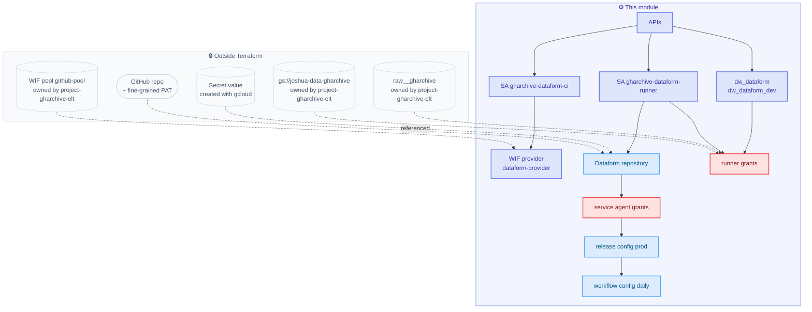

# terraform

> ↩ Back to [project overview](../README.md)

**What this is.** A single flat root module — no submodules, no workspaces — that provisions everything
the Dataform project needs in `joshua-data`: two BigQuery datasets, two service accounts, the IAM that
makes strict act-as work, a WIF provider for CI, and the Dataform repository with its release and
workflow configs.

**How it runs.** The first apply is local under your Owner credentials. After that, GitHub Actions
applies on every push to `main` that touches `terraform/**`.

**Where to start reading.** `locals.tf` — every name, role list and label in the module is defined there
and referenced everywhere else.

---

## Resource map



---

## Files

| File | Holds |
|---|---|
| `main.tf` | providers, versions, GCS backend stub, `data google_project` |
| `variables.tf` | 3 required inputs, 10 operational inputs with defaults and validation |
| `locals.tf` | every name, role list and label used anywhere in the module |
| `apis.tf` | `google_project_service` for the 8 APIs this module needs |
| `bigquery.tf` | `dw_dataform` and `dw_dataform_dev` |
| `iam.tf` | runner SA, Dataform service agent grants, CI deployer SA |
| `wif.tf` | the `dataform-provider` OIDC provider and its `workloadIdentityUser` binding |
| `dataform.tf` | the secret lookup, repository, release config, workflow config |
| `outputs.tf` | values to register as GitHub Variables and Secrets |

Both providers are required. `google_dataform_repository` exists in the GA provider, but
`google_dataform_repository_release_config` and `google_dataform_repository_workflow_config` are
**beta-only** — checked against `terraform-provider-google` v8.4.0, whose `google/services/dataform/`
directory ships `resource_dataform_repository.go` and nothing else.

---

## Inputs

| Variable | Default | Notes |
|---|---|---|
| `project_id` | — | required |
| `region` | — | required; must equal the location of `raw__gharchive` (`asia-northeast3`) |
| `github_repo` | — | required, `owner/name`; CI binds it to `${{ github.repository }}` |
| `git_token_secret_id` | `dataform-github-token` | must already exist; see the runbook |
| `prod_stg_start_date` | `2026-09-01` | first production backfill boundary |
| `prod_lookback_days` | `"2"` | incremental checkpoint reach |
| `prod_freshness_hours` | `"3"` | `assert_raw_freshness` threshold |
| `prod_completeness_lookback_days` | `"7"` | `assert_raw_hourly_completeness` window |
| `dev_table_expiration_days` | `14` | cost guard on `dw_dataform_dev` |
| `release_cron` | `30 0 * * *` | must precede `workflow_cron` |
| `workflow_cron` | `0 1 * * *` | |
| `schedule_timezone` | `Etc/UTC` | |
| `workflow_disabled` | `false` | suspend scheduled runs without destroying anything |
| `fully_refresh_incremental_tables` | `false` | flip for a one-off backfill |

The four `prod_*` var values are strings because Dataform vars are always strings — a number here fails
the provider's type check, and a number in `workflow_settings.yaml` fails compilation.

## Outputs → GitHub

| Output | Register as |
|---|---|
| `project_id` | Variable `GCP_PROJECT_ID` |
| `region` | Variable `GCP_REGION` |
| `ci_sa_email` | Secret `GCP_SA_EMAIL` |
| `wif_provider_id` | Secret `GCP_WIF_PROVIDER` |
| `dataform_runner_sa_email`, `dataform_agent`, `dataform_repository`, `datasets`, … | operational reference |

---

## Service accounts

### `gharchive-dataform-runner`

The identity every workflow invocation executes as. The official Dataform guide grants BigQuery roles at
the project level; these are narrowed to specific datasets, which is precisely why Terraform has to
create the output datasets — the runner cannot create a dataset.

| Scope | Role | Why |
|---|---|---|
| project | `roles/bigquery.jobUser` | create query jobs |
| dataset `raw__gharchive` | `roles/bigquery.dataViewer` | read the source |
| bucket `joshua-data-gharchive` | `roles/storage.objectViewer` | **an external table is read as the caller** — BigQuery permission alone is not enough |
| `dw_dataform`, `dw_dataform_dev` | `roles/bigquery.dataEditor` | create tables and assertion views |

### Dataform service agent (`service-<project-number>@gcp-sa-dataform.iam.gserviceaccount.com`)

Google-managed and created automatically with the project's **first** Dataform repository. Strict act-as
is enforced on every repository, so the agent must be able to impersonate the runner.

| Target | Role |
|---|---|
| runner SA | `roles/iam.serviceAccountTokenCreator`, `roles/iam.serviceAccountUser` |
| secret `dataform-github-token` | `roles/secretmanager.secretAccessor` |

All three carry `depends_on = [google_dataform_repository.this]`. Granting a role to a member that does
not exist yet fails, and on the very first apply in a project the agent does not exist until the
repository is created. On every subsequent apply the ordering is a no-op.

### `gharchive-dataform-ci`

Impersonated by GitHub Actions to run `terraform apply`. Project roles: `viewer`, `dataform.admin`,
`bigquery.jobUser`, `iam.serviceAccountAdmin`, `resourcemanager.projectIamAdmin`,
`iam.workloadIdentityPoolAdmin`, `serviceusage.serviceUsageAdmin`. Plus `bigquery.dataOwner` on the two
datasets it owns, `secretmanager.admin` scoped to the single Git-token secret, and `serviceAccountUser`
on the runner — required because `google_dataform_repository.service_account` is an act-as.

`resourcemanager.projectIamAdmin` is broad enough for CI to escalate itself. That is the same trade-off
`project-gharchive-elt` already makes for its deployer, and it is what lets this module own its IAM.

---

## Non-obvious choices

**The state prefix, not the bucket, is what separates the two projects.** Backend is
`bucket=joshua-data-gharchive-tfstate`, `prefix=dataform/state`. That bucket already exists with
versioning, UBLA, public-access-prevention and a noncurrent-version lifecycle, created by
`project-gharchive-elt/terraform/bootstrap.sh`. Reusing it with a different prefix means there is no
bootstrap step here and no second bucket to maintain.

**Resources owned by the other state are referenced, never declared.** `raw__gharchive`, `dw`, `dw_dev`,
`gs://joshua-data-gharchive` and the WIF pool `github-pool` all belong to `project-gharchive-elt`. This
module only adds `*_iam_member` resources against them, which are additive and cannot clobber the other
state's grants.

**A second WIF provider, not a second pool.** `github-pool` already carries `github-provider`, whose
attribute condition is hard-pinned to `assertion.repository == "joshua-data/project-gharchive-elt"`. No
other repository can satisfy it. Providers are independent resources, so this module adds
`dataform-provider` inside the same pool rather than duplicating the pool. If the other repo ever
destroys the pool, re-apply here.

**The Git token never enters Terraform state.** `dataform.tf` looks up the secret (not a secret
*version*) purely to hang an IAM binding on it, and addresses the version as a constructed string ending
in `/versions/latest`. Using `data "google_secret_manager_secret_version"` would pull the token itself
into `terraform.tfstate` in plaintext — which defeats the whole reason the secret is created outside
Terraform. The alias also means rotating the token requires no Terraform run.

**`schema_suffix = "dev"`, not `"_dev"`.** Dataform core adds the underscore
(`finalizeSchema` → `` `${schema}_${schemaSuffix}` ``). The Terraform registry example shows `"_suffix"`;
copying that literally yields `dw_dataform__dev`.

**Release cron precedes workflow cron.** A workflow config executes the release config's *latest*
compilation result. 00:30 compiles, 01:00 executes. Reverse them and every run is a day stale.

**`disable_on_destroy = false` on every API.** Destroying this state must never disable an API the ELT
pipeline is still using.

---

## Runbook

### First apply (local, once)

```bash
# 0. Prerequisites: the GitHub repo exists, main is pushed, and the secret exists.
#    See ../README.md step 1.

cd terraform
cp terraform.tfvars.example terraform.tfvars

terraform init \
  -backend-config="bucket=joshua-data-gharchive-tfstate" \
  -backend-config="prefix=dataform/state"

terraform plan     # 36 to add
terraform apply
terraform output
```

Then register the four values from the outputs table as GitHub Variables and Secrets. From the next push
onward, CI applies.

### Verify

```bash
bq ls joshua-data:dw_dataform
bq show --format=prettyjson joshua-data:dw_dataform_dev   # location, expiration, labels

gcloud iam service-accounts get-iam-policy \
  gharchive-dataform-runner@joshua-data.iam.gserviceaccount.com   # agent token creator + SA user
```

In the console under **BigQuery → Dataform**, open `gharchive-dataform` and check Settings shows the
runner service account and the `dev` workspace compilation override. Then run release config `prod`
manually, then workflow config `daily` manually, and confirm the invocation executed as
`gharchive-dataform-runner` and wrote to `dw_dataform`.

---

## Troubleshooting

| Symptom | Suspect | Fix |
|---|---|---|
| `apply` fails reading the secret | `dataform-github-token` does not exist | Create it with gcloud first; Terraform only references it |
| Repository cannot fetch code from GitHub | PAT scope, or the agent's `secretAccessor` | PAT needs Contents on that repository; check `agent_git_token_accessor` applied |
| Agent IAM fails with "member does not exist" | first repository in the project not created yet | Re-run apply; `depends_on` normally handles this |
| Workflow invocation fails on act-as | agent missing Token Creator / SA User | Check both grants on the runner SA; look for the denial in Cloud Logging |
| Reading `ext__events` fails with a permission error | **GCS bucket grant** | External tables read GCS as the caller — confirm `runner_gharchive_bucket_roles` applied |
| Location mismatch errors | `defaultLocation` vs dataset location | Everything must be `asia-northeast3` |
| Duplicates appear in an incremental table | `updatePartitionFilter` too narrow | Source filter and MERGE filter must share the same `checkpoint_date` |
| `vars.xxx` is `undefined` in production | a key missing from `code_compilation_config.vars` | That map replaces the committed vars wholesale; list all five |
| A local CLI run wrote to production | forgot `--schema-suffix=dev` | Use the console workspace, or always pass the flag |
| CI cannot mint a token | pushed to a non-`main` ref | The attribute condition requires `refs/heads/main` |
